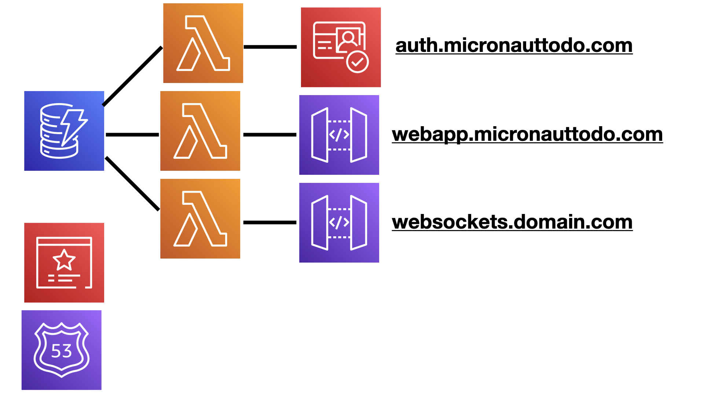
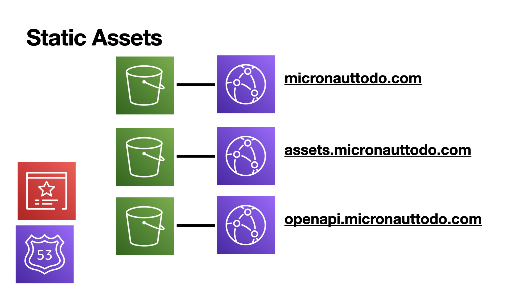
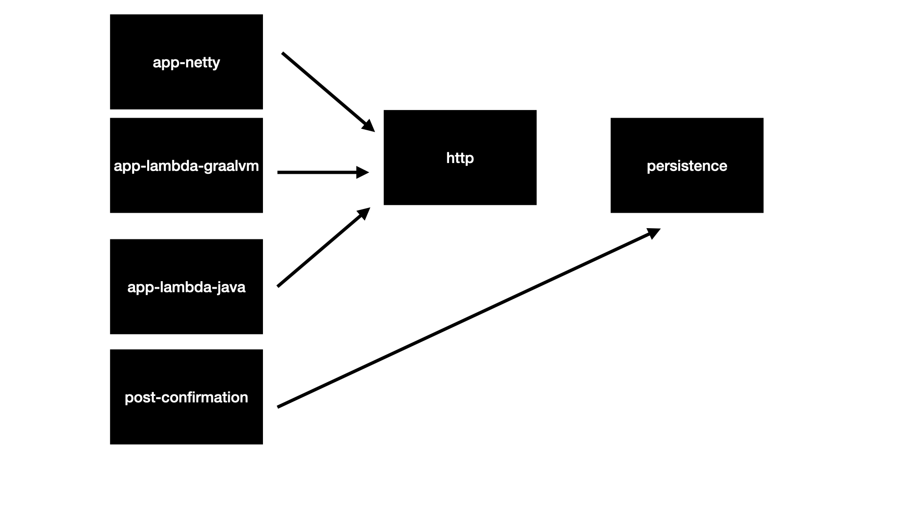
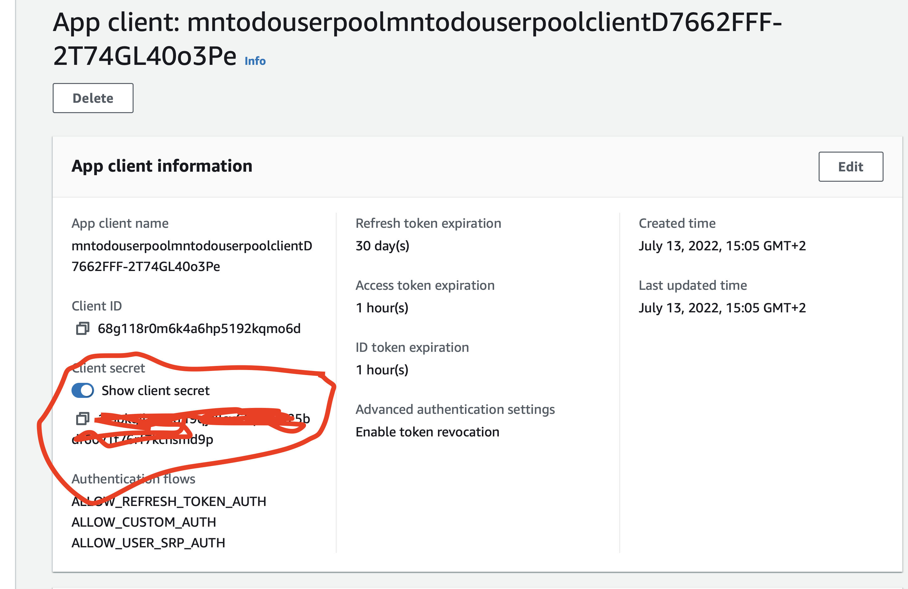
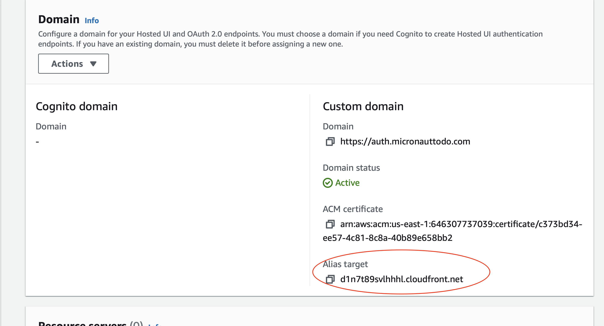
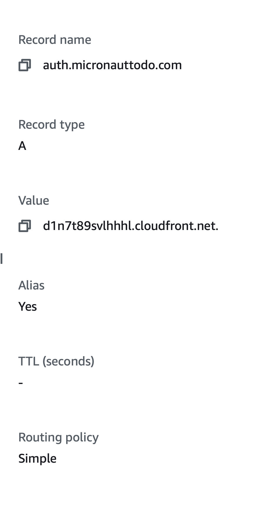

A serverless application built in Java and the [Micronaut Framework](https://micronaut.io). 

https://micronauttodo.com


It uses: 

- [Route53](https://aws.amazon.com/route53/)
- [Amazon API Gateway](https://aws.amazon.com/api-gateway/)
- [AWS Lambda](https://aws.amazon.com/lambda/)
- [Amazon Cognito](https://aws.amazon.com/cognito/)
- [Amazon Certificate Manager](https://aws.amazon.com/certificate-manager/)
- [Amazon DynamoDB](https://aws.amazon.com/dynamodb/) table for storage.

One lambda is deployed a [GraalVM](https://www.graalvm.org) native executable using AWS Lambda Custom Runtime. 

## Architecture





## Modules



## Deploy


## Manual Steps

## expose OAuth Client Secret as an env variable to LAMBDA




## A Record for auth subdomain

Create an A Record for `auth.` with an alias to your cognito user pool cloud front distribution





## Requirements

- [AWS CLI](https://aws.amazon.com/cli/)
- [AWS CDK](https://aws.amazon.com/cdk/)
- Java 11


## How to Deploy 

Change `Main.java` to use your project domain name. 

Use AWS CLI to authenticate.

```
% aws configure
AWS Access Key ID [****************]: 
AWS Secret Access Key [****************]: 
Default region name [us-east-1]:
Default output format [None]:
```

Run the release script

```
% ./release.sh

```

## Local Development

Run [DynamoDB Local via Docker](https://docs.aws.amazon.com/amazondynamodb/latest/developerguide/DynamoDBLocal.html)

```
docker run -it --rm -p 8000:8000 amazon/dynamodb-local
```

