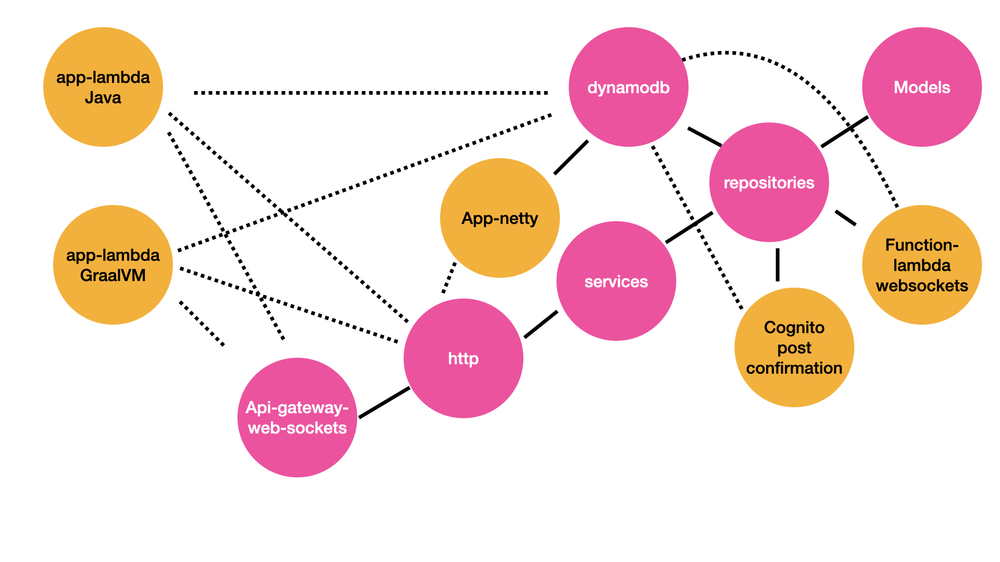

## Architecture

## Modules

## Manual Steps

## expose OAuth Client Secret as an env variable to LAMBDA

## A Record for auth subdomain

Create an A Record for `auth.` with an alias to your cognito user pool cloud front distribution

